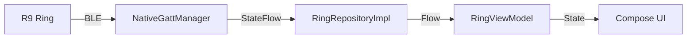
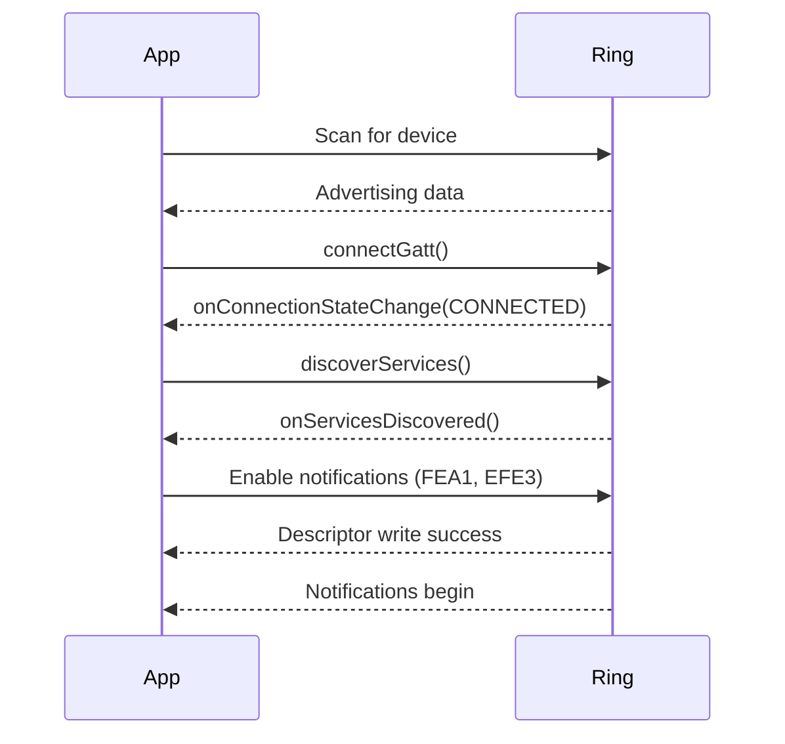

# R9 Smart Ring BLE Integration - Complete Technical Documentation

## Overview

This document details how we successfully integrated the R9 smart ring with our Android app using **native Android BLE APIs** without relying on any proprietary SDK. We reverse-engineered the ring's BLE protocol by analyzing raw characteristic data.

---

## Architecture



### Key Files

| File | Purpose |
|------|---------|
| `NativeGattManager.kt` | Core BLE connection, service discovery, and data parsing |
| `BleState.kt` | Data classes for ring state (`RingData`, `BleConnectionState`) |
| `RingRepositoryImpl.kt` | Repository layer exposing ring data flows |
| `RingViewModel.kt` | ViewModel for UI state management |

---

## BLE Services & Characteristics

The R9 ring exposes multiple BLE services. We identified the following key ones:

### Primary Services

| Service UUID | Name | Purpose |
|--------------|------|---------|
| `0000FEE7-0000-1000-8000-00805f9b34fb` | FEE7 | Main health data service |
| `f000efe0-0451-4000-0000-00000000b000` | EFE0 | Custom YC health service |

### Key Characteristics

| Characteristic | UUID | Properties | Data Content |
|----------------|------|------------|--------------|
| **FEA1** | `0000FEA1-...` | Notify | Steps count (real-time) |
| **FEA2** | `0000FEA2-...` | Indicate | Potential HR data (not confirmed) |
| **FEC7** | `0000FEC7-...` | Write | Command characteristic |
| **EFE1** | `f000efe1-...` | Write | Command characteristic |
| **EFE3** | `f000efe3-...` | Notify | Battery, status, config data |

---

## Connection Flow



### Code: Enabling Notifications

```kotlin
// Subscribe to FEA1 for steps data
gatt.getService(SERVICE_FEE7)?.getCharacteristic(CHAR_FEA1)?.let { char ->
    gatt.setCharacteristicNotification(char, true)
    val descriptor = char.getDescriptor(CCCD_UUID)
    descriptor.value = BluetoothGattDescriptor.ENABLE_NOTIFICATION_VALUE
    gatt.writeDescriptor(descriptor)
}

// Subscribe to EFE3 for battery/status data
gatt.getService(CUSTOM_SERVICE_EFE0)?.getCharacteristic(CUSTOM_CHAR_EFE3)?.let { char ->
    gatt.setCharacteristicNotification(char, true)
    val descriptor = char.getDescriptor(CCCD_UUID)
    descriptor.value = BluetoothGattDescriptor.ENABLE_NOTIFICATION_VALUE
    gatt.writeDescriptor(descriptor)
}
```

---

## Data Parsing - The Reverse Engineering Process

### The Challenge

The ring sends raw byte arrays without documentation. We had to:
1. Log all incoming data
2. Compare values with the Chinese app
3. Identify which bytes contain which data

### Methodology

```
1. Connect to ring
2. Log ALL incoming characteristic data with hex + int representation
3. Compare logged values against known data (Chinese app shows 69% battery, 463 steps)
4. Find matching values in byte arrays
5. Implement parsing logic
```

---

## Steps Data Parsing

### Discovery Process

We observed FEA1 notifications arriving every ~5 seconds:

```
📦 DATA RECEIVED
UUID: 0000fea1-0000-1000-8000-00805f9b34fb
Hex: 078901002601000B0000
Int: [7, 137, 1, 0, 38, 1, 0, 11, 0, 0]
```

When Chinese app showed **393 steps**, we saw `byte[1] = 137` and `byte[2] = 1`.

**Key insight**: Steps use **16-bit little-endian** encoding!
- `137 + (1 × 256) = 137 + 256 = 393` ✅

### Final FEA1 Parsing Code

```kotlin
private fun parseFea1Data(value: ByteArray) {
    if (value.size < 2) return
    
    val packetType = value[0].toInt() and 0xFF
    
    // Only parse if packet type is 7 (status packet)
    if (packetType == 7) {
        // Steps: 16-bit little-endian at bytes[1-2]
        val steps = if (value.size >= 3) {
            val steps16bit = (value[1].toInt() and 0xFF) or 
                           ((value[2].toInt() and 0xFF) shl 8)
            if (value[2].toInt() != 0) {
                steps16bit  // Use 16-bit if high byte is non-zero
            } else {
                value[1].toInt() and 0xFF  // Use single byte
            }
        } else {
            value[1].toInt() and 0xFF
        }
        
        _ringData.value = _ringData.value.copy(
            steps = steps,
            lastUpdate = System.currentTimeMillis()
        )
    }
}
```

### FEA1 Packet Format

```
FEA1 Packet (10 bytes):
┌─────┬─────────┬─────────┬─────┬─────┬─────┬─────┬─────┬─────┬─────┐
│  0  │    1    │    2    │  3  │  4  │  5  │  6  │  7  │  8  │  9  │
├─────┼─────────┼─────────┼─────┼─────┼─────┼─────┼─────┼─────┼─────┤
│Type │Steps-Lo │Steps-Hi │  0  │  ?  │  ?  │  0  │  ?  │  0  │  0  │
│ 7   │  (LSB)  │  (MSB)  │     │     │     │     │     │     │     │
└─────┴─────────┴─────────┴─────┴─────┴─────┴─────┴─────┴─────┴─────┘
```

---

## Battery Data Parsing

### The Problem

Standard BLE Battery Service (0x2A19) returned **100%** always (incorrect).
We needed to find the real battery in EFE3 characteristic data.

### Discovery Process

EFE3 sends multiple packet types. We logged them all:

```
Type 0x0F, Subtype 0x06:
Int: [15, 6, 26, 1, 20, 16, 22, 32, 69, 0, 0, 5, 106, 0, 1, 20, 0, 0, 0, 0]
                                   ^^
                              byte[8] = 69
```

When Chinese app showed **69% battery**, we found `byte[8] = 69` ✅

### EFE3 Packet Types

| Type | Subtype | Purpose | Battery Location |
|------|---------|---------|------------------|
| 0x0F | 0x06 | Status/timestamp packet | **byte[8]** ✅ |
| 0x0F | 0x85 | Unknown (ignore) | N/A |
| 0x88 | - | Alternative status | byte[8] |
| 0xF0 | - | Configuration data | N/A |
| 0x81 | - | ACK/response | N/A |

### Final EFE3 Parsing Code

```kotlin
private fun parseEfe3Data(value: ByteArray) {
    if (value.size < 9) return
    
    val packetType = value[0].toInt() and 0xFF
    val packetSubType = value[1].toInt() and 0xFF
    
    when (packetType) {
        0x0F -> {
            when (packetSubType) {
                0x06 -> {
                    // Status packet: battery at byte[8]
                    val battery = value[8].toInt() and 0xFF
                    if (battery in 1..100) {
                        _ringData.value = _ringData.value.copy(
                            battery = battery,
                            lastUpdate = System.currentTimeMillis()
                        )
                    }
                }
            }
        }
        0x88 -> {
            // Alternative battery source at byte[8]
            val battery = value[8].toInt() and 0xFF
            if (battery in 1..100) {
                _ringData.value = _ringData.value.copy(
                    battery = battery,
                    lastUpdate = System.currentTimeMillis()
                )
            }
        }
    }
}
```

### EFE3 Type 0x06 Packet Format

```
EFE3 Status Packet (Type 0x0F, Subtype 0x06) - 20 bytes:
┌─────┬─────┬─────┬─────┬─────┬─────┬─────┬─────┬─────────┬─────┬─────┬─────┬─────┬─────┬─────┐
│  0  │  1  │  2  │  3  │  4  │  5  │  6  │  7  │    8    │  9  │ 10  │ 11  │ 12  │ 13  │ 14  │
├─────┼─────┼─────┼─────┼─────┼─────┼─────┼─────┼─────────┼─────┼─────┼─────┼─────┼─────┼─────┤
│0x0F │0x06 │Year │Month│ Day │Hour │ Min │ Sec │ BATTERY │  0  │  0  │  ?  │  ?  │  0  │  ?  │
│Type │Sub  │     │     │     │     │     │     │   (%)   │     │     │     │     │     │     │
└─────┴─────┴─────┴─────┴─────┴─────┴─────┴─────┴─────────┴─────┴─────┴─────┴─────┴─────┴─────┘
```

---

## Heart Rate - Investigation Status

### Current State: ⚠️ Partially Working

We can send HR measurement commands, but the ring only returns acknowledgments (0x81) without actual HR data.

### Commands Sent

```kotlin
val hrCommands = listOf(
    byteArrayOf(0x0F, 0x15, 0x01),  // Start HR measurement
    byteArrayOf(0x0F, 0x16, 0x01),  // Start real-time HR
    byteArrayOf(0x15, 0x01),         // Simple HR start
    byteArrayOf(0x16, 0x01),         // Real-time HR
)
```

### Ring Response

```
Command: 0x15, 0x01
Response: Type 0x81 (ACK) - [129, 0, 0, 0, ...]
```

### Potential HR Location (Unconfirmed)

Byte[12] in Type 0x06 packets sometimes shows values close to actual HR, but not consistently matching.

### Next Steps for HR

1. **Sniff Chinese app BLE traffic** to see exact command sequence
2. **Ensure ring is worn** during measurement (sensor needs skin contact)
3. **Look for different packet types** after triggering measurement

---

## Summary - What Works

| Feature | Status | Source | Byte Position |
|---------|--------|--------|---------------|
| **Battery** | ✅ Working | EFE3 Type 0x06 | byte[8] |
| **Steps** | ✅ Working | FEA1 | bytes[1-2] (16-bit LE) |
| **Heart Rate** | ⚠️ Partial | Unknown | TBD |

---

## Key Learnings

### 1. Standard Services May Not Work
The ring's Battery Service (0x2A19) returns incorrect data. Always verify against known values.

### 2. Log Everything
Comprehensive logging of all characteristic data is essential for reverse engineering.

### 3. Multi-Byte Values
Health data often uses multi-byte encoding (16-bit little-endian for steps).

### 4. Multiple Packet Types
Characteristics may send different packet types for different data. Parse based on type/subtype bytes.

### 5. Acknowledgments Are Not Data
Receiving ACKs (0x81) means the ring received your command, but doesn't mean data is coming on the same characteristic.

---

## Code References

- [NativeGattManager.kt](file:///C:/Users/adhik/Downloads/DKGS%20LABS/Ring/FitnessAndroidApp/src/main/kotlin/com/fitness/app/ble/NativeGattManager.kt) - BLE connection and parsing
- [BleState.kt](file:///C:/Users/adhik/Downloads/DKGS%20LABS/Ring/FitnessAndroidApp/src/main/kotlin/com/fitness/app/ble/BleState.kt) - Data models
- [RingRepositoryImpl.kt](file:///C:/Users/adhik/Downloads/DKGS%20LABS/Ring/FitnessAndroidApp/src/main/kotlin/com/fitness/app/data/repository/RingRepositoryImpl.kt) - Repository layer
