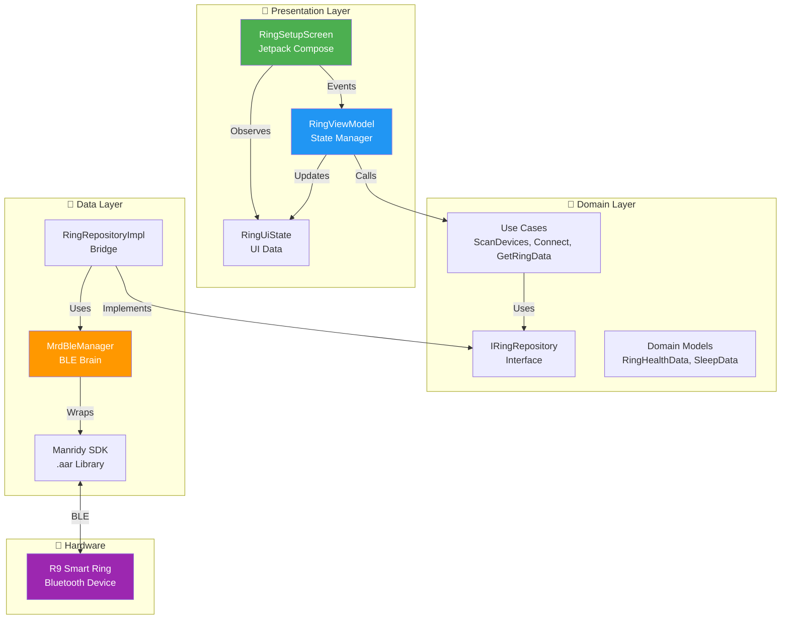
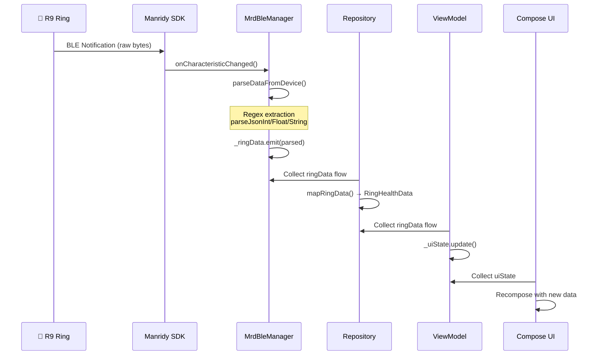

# 💍 FitnessAndroidApp

> **Smart Ring Health Monitoring Application for R9 Ring**
> 
> Built with Kotlin, Jetpack Compose, Clean Architecture & MVVM

[](https://developer.android.com)
[](https://kotlinlang.org)
[](https://developer.android.com/jetpack/compose)
[](https://developer.android.com/topic/architecture)

---

## 📋 Table of Contents

- [Overview](#-overview)
- [Features](#-features)
- [Architecture](#-architecture)
- [Data Flow Pipeline](#-data-flow-pipeline)
- [Data Parsing System](#-data-parsing-system)
- [Core Algorithms](#-core-algorithms)
- [Project Structure](#-project-structure)
- [Setup & Installation](#-setup--installation)
- [Future Improvements](#-future-improvements)

---

## 🎯 Overview

FitnessAndroidApp connects to the **R9 Smart Ring** via Bluetooth Low Energy (BLE) to monitor vital health metrics in real-time. The app uses the **Manridy MRD SDK** for BLE communication and implements a reactive architecture where the ring pushes data → app parses → UI automatically updates.

### Tech Stack

| Layer | Technology |
|-------|------------|
| **UI** | Jetpack Compose, Material 3 |
| **Architecture** | Clean Architecture + MVVM |
| **Async** | Kotlin Coroutines, StateFlow |
| **BLE** | Manridy MRD SDK (v1.1.5) |
| **DI** | Manual Dependency Injection |

---

## ✨ Features

| Metric | Description | Measurement |
|--------|-------------|-------------|
| ❤️ **Heart Rate** | Real-time BPM monitoring | 30-second timed |
| 🩸 **Blood Pressure** | Systolic/Diastolic readings | 30-second timed |
| 🫁 **SpO2** | Blood oxygen saturation % | 30-second timed |
| 😰 **Stress/HRV** | Heart rate variability analysis | 30-second timed |
| 👟 **Steps** | Daily step count, calories, distance | Automatic |
| 😴 **Sleep** | Deep/light/awake tracking with quality score | Historical |
| 🔋 **Battery** | Ring battery level monitoring | Real-time |

---

## 🏗 Architecture

The application follows **Clean Architecture** with three distinct layers, ensuring separation of concerns and testability.



### Layer Responsibilities

| Layer | Responsibility | Key Files |
|-------|----------------|-----------|
| **Presentation** | UI rendering, user input, state observation | `RingSetupScreen.kt`, `RingViewModel.kt`, `RingUiState.kt` |
| **Domain** | Business logic, use cases, data contracts | `IRingRepository.kt`, `RingHealthData.kt`, `UseCases/` |
| **Data** | SDK integration, BLE operations, data parsing | `MrdBleManager.kt`, `RingRepositoryImpl.kt` |

---

## 🔄 Data Flow Pipeline

The app uses a **reactive streaming architecture** where data flows unidirectionally from the ring to the UI.



### StateFlow Streams

| Stream | Source | Consumer | Data |
|--------|--------|----------|------|
| `connectionState` | MrdBleManager | Repository → ViewModel | BleConnectionState |
| `ringData` | MrdBleManager | Repository → ViewModel | RingData → RingHealthData |
| `scanResults` | MrdBleManager | Repository → ViewModel | List<Ring> |
| `measurementTimer` | MrdBleManager | Repository → ViewModel | MeasurementTimer |

---

## 🔍 Data Parsing System

### Why Regex Instead of JSON Libraries?

The R9 Ring sends data as JSON strings, but with **quirks** that break standard parsers:

| Issue | Example | Problem |
|-------|---------|---------|
| Missing quotes | `{heartRate: 72}` | Gson throws `MalformedJsonException` |
| Partial fragments | `{"heartRate": 72` | Incomplete JSON |
| Mixed formats | `"boRate":"99.5"` vs `boRate:99.5` | Inconsistent quoting |

**Solution**: Robust Regex patterns that handle all variations:

```kotlin
// Handles: "heartRate":72, heartRate:72, "heartRate": 72
private fun parseJsonInt(json: String?, key: String): Int? {
    val regex = "\"?$key\"?\\s*:\\s*(\\d+)".toRegex()
    return regex.find(json)?.groupValues?.get(1)?.toIntOrNull()
}
```

### Parser Functions

| Function | Purpose | Pattern | Example Match |
|----------|---------|---------|---------------|
| `parseJsonInt()` | Integer values | `"?key"?\s*:\s*(\d+)` | `"steps": 5420` → `5420` |
| `parseJsonFloat()` | Decimal values | `"?key"?\s*:\s*"?([0-9]+\.?[0-9]*)"?` | `"boRate":"99.5"` → `99.5f` |
| `parseJsonString()` | String values | `"?key"?\s*:\s*"([^"]*)"` | `"sleepStartTime":"23:30"` → `"23:30"` |

### Data Field Mappings

The parser handles multiple key variations for backward compatibility:

```kotlin
// Heart Rate - try multiple keys
val hr = parseJsonInt(json, "heartRate") ?: parseJsonInt(json, "heart")

// Steps - SDK uses different naming
val steps = parseJsonInt(json, "stepNum") 
         ?: parseJsonInt(json, "step") 
         ?: parseJsonInt(json, "steps")

// Blood Pressure - Chinese SDK vs English
val systolic = parseJsonInt(json, "bpHp") ?: parseJsonInt(json, "hightBp")
```

---

## ⚙️ Core Algorithms

### 1. Sleep Quality Score (0-100)

Based on medical research indicating optimal deep sleep is 15-25% of total sleep:

```kotlin
fun calculateSleepQuality(deepMinutes: Int, totalMinutes: Int): Int {
    val deepPercentage = (deepMinutes.toFloat() / totalMinutes * 100).toInt()
    
    return when {
        deepPercentage >= 20 -> 90  // Excellent
        deepPercentage >= 15 -> 75  // Good  
        deepPercentage >= 10 -> 60  // Fair
        else -> 40                   // Poor
    }
}
```

### 2. Connection Keep-Alive

Prevents BLE timeout by requesting data every 5 seconds:

```kotlin
private fun startKeepAlive() {
    keepAliveJob = ioScope.launch {
        while (isActive) {
            delay(5000)
            requestBattery()  // Lightweight ping
        }
    }
}
```

### 3. Timed Measurement (30 seconds)

Health measurements require sensor stabilization time:

```kotlin
private fun startTimedMeasurement(type: MeasurementType, requestFunc: () -> Unit) {
    measurementJob = launch {
        for (second in 30 downTo 0) {
            _measurementTimer.emit(MeasurementTimer(second))
            if (second % 2 == 0) requestFunc()  // Sample every 2s
            delay(1000)
        }
    }
}
```

---

## 📁 Project Structure

```
FitnessAndroidApp/
├── src/main/kotlin/com/fitness/app/
│   ├── 📱 presentation/          # UI Layer
│   │   └── ring/
│   │       ├── RingViewModel.kt      # State management
│   │       ├── RingUiState.kt        # UI data model
│   │       └── screens/
│   │           └── RingSetupScreen.kt
│   │
│   ├── 🧠 domain/                # Business Layer
│   │   ├── model/
│   │   │   ├── RingHealthData.kt     # Health data model
│   │   │   ├── Ring.kt               # Device model
│   │   │   └── SleepData.kt
│   │   ├── repository/
│   │   │   └── IRingRepository.kt    # Contract interface
│   │   └── usecase/
│   │       ├── ScanDevicesUseCase.kt
│   │       ├── ConnectRingUseCase.kt
│   │       └── GetRingDataUseCase.kt
│   │
│   ├── 💾 data/                  # Data Layer
│   │   └── repository/
│   │       └── RingRepositoryImpl.kt # Repository implementation
│   │
│   ├── 🔵 ble/                   # BLE Layer
│   │   ├── MrdBleManager.kt          # SDK wrapper & parsing
│   │   └── BleState.kt               # Connection states
│   │
│   ├── 🎨 ui/                    # Shared UI Components
│   │   └── components/
│   │
│   └── 🔧 core/                  # Utilities
│       ├── di/AppContainer.kt        # Dependency injection
│       └── util/Result.kt
│
├── libs/
│   └── sdk_mrd20240218_1.1.5.aar     # Manridy BLE SDK
│
└── build.gradle.kts
```

---

## 🚀 Setup & Installation

### Prerequisites

- Android Studio Hedgehog (2023.1.1) or later
- Android SDK 24+ (Android 7.0)
- Physical Android device with Bluetooth (emulators don't support BLE)
- R9 Smart Ring

### Build Steps

```bash
# 1. Clone the repository
git clone <repository-url>

# 2. Open in Android Studio
# File → Open → Select FitnessAndroidApp folder

# 3. Sync Gradle
# Android Studio will auto-sync, or click "Sync Now"

# 4. Run on device
# Select your physical device and click Run
```

### Permissions

The app requires these permissions (handled at runtime):

| Permission | Android Version | Purpose |
|------------|-----------------|---------|
| `BLUETOOTH_SCAN` | 12+ (API 31) | Discover nearby rings |
| `BLUETOOTH_CONNECT` | 12+ (API 31) | Connect to ring |
| `ACCESS_FINE_LOCATION` | All | BLE scanning requires location |
| `BLUETOOTH`, `BLUETOOTH_ADMIN` | < 12 | Legacy BLE permissions |

---

## 🔮 Future Improvements

### Short-Term Enhancements

| Improvement | Description | Priority |
|-------------|-------------|----------|
| **Data Persistence** | Store health data in Room database for history | High |
| **Charts & Graphs** | Visualize trends over time with MPAndroidChart | High |
| **Notifications** | Alert on abnormal heart rate or low battery | Medium |
| **Export Data** | CSV/PDF export for sharing with doctors | Medium |

### Architecture Improvements

| Improvement | Description | Benefit |
|-------------|-------------|---------|
| **Hilt DI** | Replace manual DI with Hilt annotations | Testability |
| **Unit Tests** | Add ViewModel and parsing tests | Reliability |
| **Modularization** | Split into `:ble`, `:domain`, `:ui` modules | Build speed |
| **Error Handling** | Centralized error reporting system | UX |

### BLE Improvements

| Improvement | Description | Benefit |
|-------------|-------------|---------|
| **Auto-Reconnect** | Detect disconnect and auto-reconnect | Reliability |
| **Multi-Ring** | Support multiple ring connections | Flexibility |
| **Background Sync** | WorkManager for periodic data sync | Battery |
| **Proper JSON Parser** | Use kotlinx.serialization with lenient mode | Robustness |

---

## 📚 Key References

| Resource | Link |
|----------|------|
| Manridy SDK Documentation | `SDK-Android-MRD-20240218_1.1.15/` |
| Android BLE Guide | [developer.android.com/guide/topics/connectivity/bluetooth-le](https://developer.android.com/guide/topics/connectivity/bluetooth-le) |
| Clean Architecture | [blog.cleancoder.com](https://blog.cleancoder.com/uncle-bob/2012/08/13/the-clean-architecture.html) |
| Kotlin Flows | [kotlinlang.org/docs/flow.html](https://kotlinlang.org/docs/flow.html) |

---

## 📄 License

Copyright © 2026 DKGS Labs. All rights reserved.

---

<p align="center">
  <b>Built with ❤️ for health monitoring</b>
</p>
