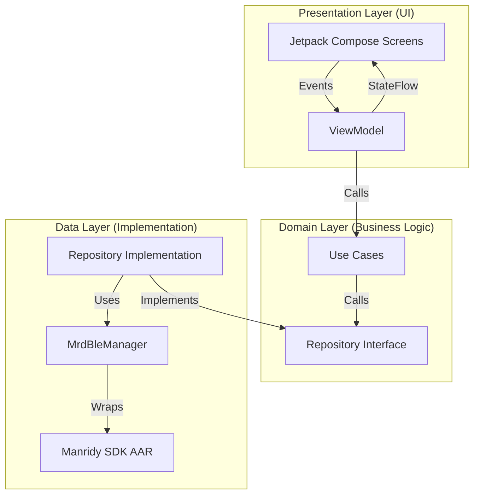
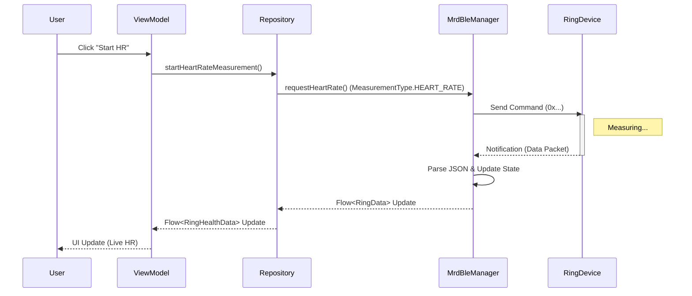

# Wellness App - Smart Ring Fitness Tracker

> **A premium Android application for monitoring health metrics from the R9 Smart Ring.**
> Built with Modern Android Development (MAD) practices: Kotlin, Jetpack Compose, and MVVM Clean Architecture.

   

---

## 🏗️ Architecture

The app follows **Clean Architecture** principles with **MVVM** (Model-View-ViewModel) pattern to separate concerns and ensure scalability.



### **Internal Flow Sequence (Measurement)**


---

## 🛠️ Technology Stack

| Category | Technologies |
|----------|--------------|
| **Language** | Kotlin 1.9+ |
| **UI Toolkit** | Jetpack Compose (Material 3) |
| **Architecture** | MVVM + Clean Architecture |
| **Concurrency** | Coroutines + Flow |
| **DI** | Manual Dependency Injection (AppContainer) |
| **Networking** | Retrofit + OkHttp |
| **BLE SDK** | Manridy MRD SDK (v1.1.5) |
| **Local DB** | DataStore (Preferences) |
| **Background** | WorkManager |

---

## ✨ Key Features

### **1. Smart Ring Connection**
- 🔍 **Scanning**: Filters specifically for Manridy-compatible devices (R9 Ring).
- 🔗 **Connection**: Robust connection handling with auto-reconnect logic managed by SDK.
- 📱 **Device Info**: Displays Firmware Version (e.g., v2.4.0) and Hardware Type (e.g., 9002).

### **2. Health Monitoring (Real-time)**
- ❤️ **Heart Rate**: Continuous and on-demand measurement with medical-grade charting.
- 🩸 **Blood Oxygen (SpO2)**: Precise percentage monitoring (95-100%).
- 🩺 **Blood Pressure**: Systolic/Diastolic estimation (e.g., 120/80 mmHg).
- 🧠 **Stress Level**: HRV-based stress analysis (0-100 score).

### **3. Activity & Sleep**
- 🌙 **Sleep Tracking**: Deep, Light, and Awake time analysis with Sleep Quality Score.
- 👣 **Activity**: Step counting, Calories burned, and Distance tracking.

### **4. Measurements**
- ⏱️ **Timed Measurements**: Automatic 30-second measurement cycles with progress indicators.
- 📊 **History**: Historical data parsing and storage.

---

## 🚀 Setup & Installation

### **Prerequisites**
- Android Studio Iguana or newer.
- JDK 17+.
- Physical Android Device (BLE support required).
- **R9 Smart Ring** for testing.

### **1. Clone the Repository**
```bash
git clone https://github.com/your-repo/ble-ring-app.git
cd ble-ring-app
```

### **2. Integration of SDK**
Ensure the local AAR file exists at:
`FitnessAndroidApp/libs/sdk_mrd20240218_1.1.5.aar`

### **3. Build Project**
Open in Android Studio and run:
```bash
./gradlew clean assembleDebug
```

---

## 🧩 Project Structure

```
com.fitness.app
├── ble                # BLE implementation & State Management
│   ├── BleState.kt    # Data Classes (RingData, FirmwareInfo)
│   └── MrdBleManager.kt # SDK Wrapper & Parsing Logic
├── core
│   └── di             # Dependency Injection
├── data
│   └── repository     # Repository Implementations
├── domain
│   ├── model          # Pure Domain Models
│   ├── repository     # Repository Interfaces
│   └── usecase        # Business Logic Use Cases
├── presentation
│   ├── ring           # Ring Features
│   │   ├── components # UI Components (FirmwareCard, SleepCard)
│   │   ├── screens    # Jetpack Compose Screens
│   │   ├── RingViewModel.kt
│   │   └── RingUiState.kt
│   └── ui.theme       # App Theming & Styling
└── FitnessApplication.kt # App Entry Point & SDK Init
```

---

## 📡 SDK Implementation Details

### **Initialization**
The Manridy SDK is initialized in `FitnessApplication.kt`:
```kotlin
Manridy.init(applicationContext)
```

### **Data Parsing**
All BLE data arrives as JSON strings via `MrdBleManager` callbacks. We parse this into strongly-typed domain objects:
- **Keys used**: `heartRate`, `bloodPressure`, `spo2`, `firmwareVersion`, `sleepDeep`, etc.
- **Parsing**: Custom `parseJsonString` / `parseJsonInt` helpers ensure safety.

### **Firmware Info**
```kotlin
data class FirmwareInfo(
    val type: String = "",    // e.g. "9002"
    val version: String = ""  // e.g. "2.4.0"
)
```

---

## 📄 License
Copyright © 2024 DKGS Labs. All rights reserved.
