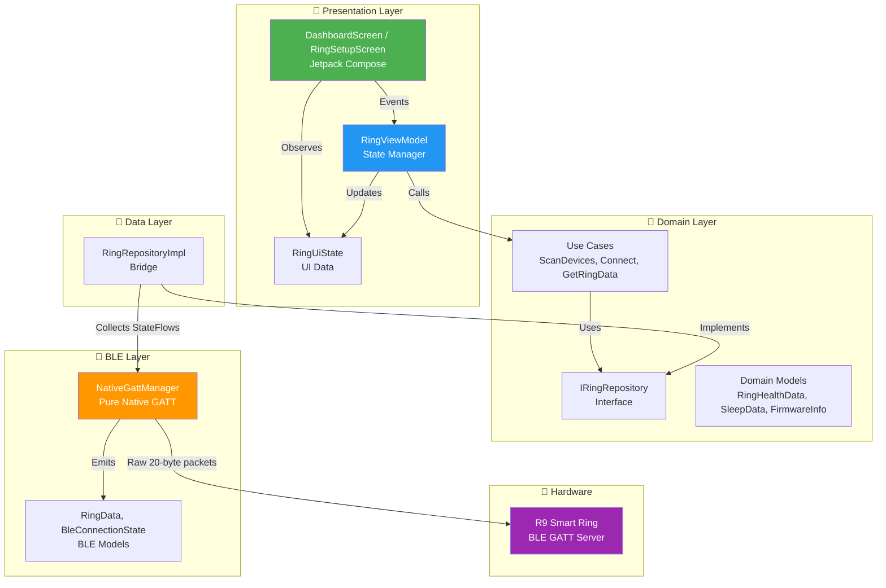
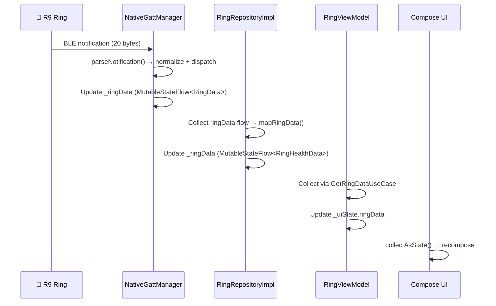
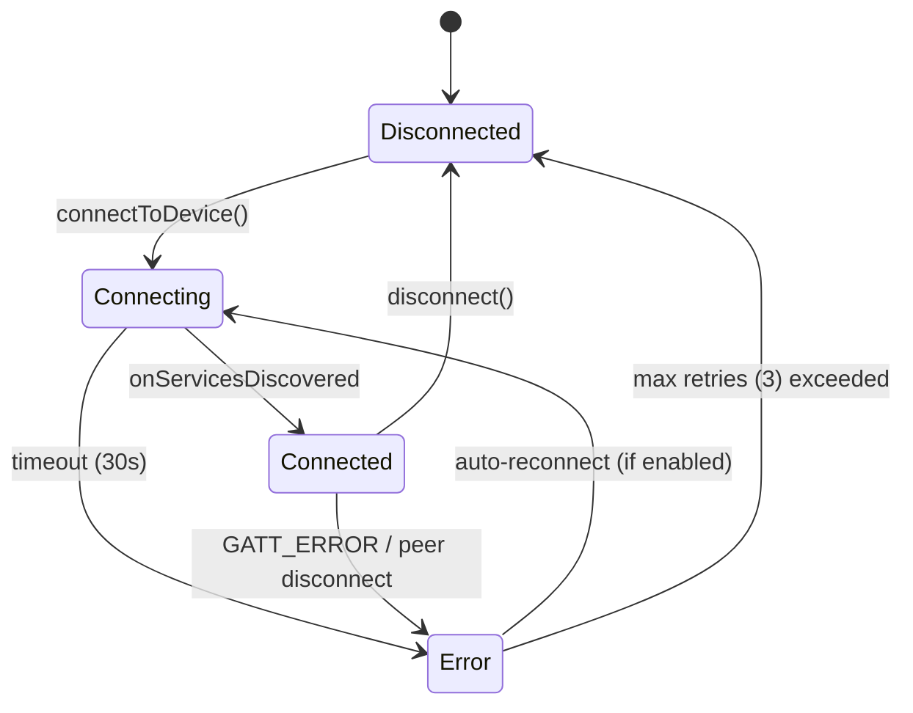

# 💍 FitnessAndroidApp — BLE Ring Health Monitor

> **Smart Ring Health Monitoring Application for R9 Ring**
> 
> Built with Kotlin, Jetpack Compose, Clean Architecture & MVVM
> 
> **Pure Native BLE** — No SDK dependency. Fully reverse-engineered protocol.

[](https://developer.android.com)
[](https://kotlinlang.org)
[](https://developer.android.com/jetpack/compose)
[](https://developer.android.com/topic/architecture)
[](#-reverse-engineering-the-ble-protocol)

---

## 📋 Table of Contents

- [Overview](#-overview)
- [Features](#-features)
- [Architecture](#-architecture)
- [Data Flow Pipeline](#-data-flow-pipeline)
- [Reverse Engineering the BLE Protocol](#-reverse-engineering-the-ble-protocol)
- [BLE Communication Protocol](#-ble-communication-protocol)
- [Data Parsing — Byte-Level Details](#-data-parsing--byte-level-details)
- [Keep-Alive & Data Refresh](#-keep-alive--data-refresh)
- [Connection Management](#-connection-management)
- [Core Algorithms](#-core-algorithms)
- [Project Structure](#-project-structure)
- [Setup & Installation](#-setup--installation)
- [Known Limitations](#-known-limitations)
- [Future Improvements](#-future-improvements)

---

## 🎯 Overview

FitnessAndroidApp connects to the **R9 Smart Ring** via Bluetooth Low Energy (BLE) to monitor vital health metrics in real-time. The app communicates with the ring using a **fully reverse-engineered byte-array protocol** — no proprietary SDK is used at runtime. All BLE commands are raw 20-byte packets and all responses are parsed at the byte level.

### Tech Stack

| Layer | Technology |
|-------|------------|
| **UI** | Jetpack Compose, Material 3, Premium Glass UI |
| **Architecture** | Clean Architecture + MVVM |
| **Async** | Kotlin Coroutines, StateFlow |
| **BLE** | Pure Native GATT (reverse-engineered protocol) |
| **DI** | Manual Dependency Injection (AppContainer) |

---

## ✨ Features

| Metric | Description | Measurement |
|--------|-------------|-------------|
| ❤️ **Heart Rate** | Real-time BPM monitoring | 30-second timed |
| 🩸 **Blood Pressure** | Systolic/Diastolic readings (mmHg) | 30-second timed |
| 🫁 **SpO2** | Blood oxygen saturation % | 30-second timed |
| 😰 **Stress/HRV** | Heart rate variability analysis | 30-second timed |
| 👟 **Steps** | Daily step count, calories, distance | Automatic / Keep-alive |
| 😴 **Sleep** | Deep/light/awake tracking with quality score | Historical |
| 🔋 **Battery** | Ring battery level + charging state | Real-time |
| 📱 **Firmware** | Ring firmware version & type | On-connect |
| 🌡️ **Temperature** | Body temperature (°C) | On-demand |

---

## 🏗 Architecture

The application follows **Clean Architecture** with four distinct layers:


```mermaid
graph TD
    subgraph "📱 Presentation Layer"
        UI["DashboardScreen / RingSetupScreen<br/>Jetpack Compose"]
        VM["RingViewModel<br/>State Manager"]
        STATE["RingUiState<br/>UI Data"]
    end

    subgraph "🧠 Domain Layer"
        UC["Use Cases<br/>ScanDevices, Connect, GetRingData"]
        REPO_INT["IRingRepository<br/>Interface"]
        MODEL["Domain Models<br/>RingHealthData, SleepData, FirmwareInfo"]
    end

    subgraph "💾 Data Layer"
        REPO["RingRepositoryImpl<br/>Bridge"]
    end

    subgraph "🔵 BLE Layer"
        BLE["NativeGattManager<br/>Pure Native GATT"]
        MODELS["RingData, BleConnectionState<br/>BLE Models"]
    end

    subgraph "💍 Hardware"
        RING["R9 Smart Ring<br/>BLE GATT Server"]
    end

    UI -->|Observes| STATE
    UI -->|Events| VM
    VM -->|Updates| STATE
    VM -->|Calls| UC
    UC -->|Uses| REPO_INT
    REPO -->|Implements| REPO_INT
    REPO -->|Collects StateFlows| BLE
    BLE -->|Raw 20-byte packets| RING
    BLE -->|Emits| MODELS

    style UI fill:#4CAF50,color:#fff
    style VM fill:#2196F3,color:#fff
    style BLE fill:#FF9800,color:#fff
    style RING fill:#9C27B0,color:#fff
```

### Layer Responsibilities

| Layer | Responsibility | Key Files |
|-------|----------------|-----------|
| **Presentation** | UI rendering, user input, state observation | `RingSetupScreen.kt`, `DashboardScreen.kt`, `RingViewModel.kt`, `RingUiState.kt` |
| **Domain** | Business logic, use cases, data contracts | `IRingRepository.kt`, `RingHealthData.kt`, `Ring.kt`, `UseCases/` |
| **Data** | BLE→Domain mapping, measurement delegation | `RingRepositoryImpl.kt` |
| **BLE** | Raw GATT operations, byte-level command/response | `NativeGattManager.kt`, `BleState.kt` |

---

## 🔄 Data Flow Pipeline

The app uses a **reactive streaming architecture** with Kotlin `StateFlow`. Data flows unidirectionally from the ring to the UI through 5 layers:


```mermaid
sequenceDiagram
    participant Ring as 💍 R9 Ring
    participant GM as NativeGattManager
    participant Repo as RingRepositoryImpl
    participant VM as RingViewModel
    participant UI as Compose UI

    Ring->>GM: BLE notification (20 bytes)
    GM->>GM: parseNotification() → normalize + dispatch
    GM->>GM: Update _ringData (MutableStateFlow<RingData>)
    Repo->>Repo: Collect ringData flow → mapRingData()
    Repo->>Repo: Update _ringData (MutableStateFlow<RingHealthData>)
    VM->>VM: Collect via GetRingDataUseCase
    VM->>VM: Update _uiState.ringData
    UI->>UI: collectAsState() → recompose
```

### StateFlow Streams

| Stream | Source | Consumer | Data |
|--------|--------|----------|------|
| `connectionState` | NativeGattManager | Repository → ViewModel | `BleConnectionState` |
| `ringData` | NativeGattManager | Repository → ViewModel | `RingData` → `RingHealthData` |
| `scanResults` | NativeGattManager | Repository → ViewModel | `List<Ring>` |
| `measurementTimer` | NativeGattManager | Repository → ViewModel | `MeasurementTimer` |

### Model Transformation Chain

| BLE Layer (`RingData`) | Domain Layer (`RingHealthData`) | UI Layer (`RingUiState`) |
|------------------------|--------------------------------|--------------------------|
| `battery: Int?` | `battery: Int?` | `batteryLevel: Int?` (derived) |
| `heartRate: Int` | `heartRate: Int` | `heartRate: Int` (derived) |
| `spO2: Float` | `spO2: Float` | `ringData.spO2` |
| `steps: Int` | `steps: Int` | `steps: Int` (derived) |
| `stress: Int` | `stress: Int` | `ringData.stress` |
| `bloodPressureSystolic: Int` | `bloodPressureSystolic: Int` | `ringData.bloodPressureSystolic` |
| `sleepData: SleepData` | `sleepData: SleepData` | `ringData.sleepData` |
| `firmwareInfo: FirmwareInfo` | `firmwareInfo: FirmwareInfo` | `ringData.firmwareInfo` |

All fields are **1:1 mapped** via `RingRepositoryImpl.mapRingData()`.

---

## 🔬 Reverse Engineering the BLE Protocol

### Background

The R9 Smart Ring ships with the **Manridy MRD SDK** (`sdk_mrd20240218_1.1.5.aar`) — a proprietary, obfuscated Android library. While functional, the SDK is a black box: class names are minified (`a.java`, `b.java`, `c.java`), documentation is minimal, and the library is not open source.

### Why We Reverse-Engineered It

1. **No SDK Dependency**: A proprietary `.aar` with obfuscated internals is fragile — any update could break the app silently.
2. **Full Control**: We needed to understand exactly what bytes go over the wire to debug data display issues, handle edge cases, and add new features.
3. **Transparency**: For a health-monitoring product, knowing *exactly* how data is parsed is critical for accuracy.

### How We Did It

The reverse engineering was performed in **three phases**:

#### Phase 1: Decompilation & Static Analysis

We decompiled the MRD SDK `.aar` file using **JADX** to recover Java source code from the obfuscated classes:

| SDK Class | True Purpose | Key Discovery |
|-----------|--------------|---------------|
| `c.java` | Command builder | All commands are 20-byte arrays starting with `0xFC` |
| `b.java` | Response parser | Dispatches on `packet[1]` (metric ID) |
| `ManConstants.java` | UUID constants | Service UUID `f000efe0-...`, Write `f000efe1-...`, Notify `f000efe3-...` |

Key insight: The SDK wraps a simple byte-array protocol behind Java object wrappers. Every command is just `FC` + metric ID + sub-command + zero padding.

#### Phase 2: Live BLE Packet Capture

We used **Android Logcat** and **nRF Connect** to capture real BLE traffic between the MRD demo app and the ring:

```
📤 App → Ring:  FC 0F 06 00 00 00 00 00 00 00 00 00 00 00 00 00 00 00 00 00  (request battery)
📥 Ring → App:  0F 06 14 08 01 0A 02 25 00 01 00 00 00 00 00 26 00 00 00 00  (battery response)
```

**Critical discovery**: The ring sometimes sends responses **without** the `0xFC` header byte. The original SDK handled this implicitly, but we had to add explicit normalization (prepending `FC` to headerless packets).

#### Phase 3: Byte Offset Mapping

We compared the decompiled SDK parsing indices against live packet captures from the ring. The MRD SDK's `b.java` file contained the byte-level parsing logic:

```java
// From b.java (decompiled)
int batteryLevel = packet[8] & 0xFF;    // Battery at index 8
int heartRate    = packet[12] & 0xFF;   // HR at index 12
int systolic     = packet[11] & 0xFF;   // BP systolic at index 11
```

**Important**: These indices assume the `FC` header is present at index 0. When the ring omits the header (Format B responses), all indices shift by -1, which caused initial data display failures. Our normalization step fixes this.

### Outcome

The result is `NativeGattManager.kt` — a **1,041-line pure Kotlin BLE manager** that:
- Sends raw 20-byte commands directly via GATT write
- Receives and normalizes BLE notifications
- Parses every metric at the byte level
- Requires **zero SDK dependency**

---

## 📡 BLE Communication Protocol

### Service & Characteristic UUIDs

| UUID | Purpose |
|------|---------|
| `f000efe0-0451-4000-0000-00000000b000` | Primary BLE Service |
| `f000efe1-0451-4000-0000-00000000b000` | **Write** characteristic (app → ring) |
| `f000efe3-0451-4000-0000-00000000b000` | **Notify** characteristic (ring → app) |
| `00002902-0000-1000-8000-00805F9B34FB` | Client Config Descriptor (enable notifications) |

### Command Packet Format (App → Ring)

All commands are **20-byte** packets. Byte 0 is always `0xFC` (header). Bytes 1–2 identify the command. Remaining bytes are zero-padded.

```
┌──────┬──────────┬──────────┬───────────────────────┐
│ 0xFC │ MetricID │ SubCmd   │ 0x00 ... (padding)    │
│ 1 B  │ 1 B      │ 1 B     │ 17 B                  │
└──────┴──────────┴──────────┴───────────────────────┘
```

### Complete Command Table

| Command | Hex Bytes | Description |
|---------|-----------|-------------|
| Battery | `FC 0F 06 00...` | Request battery level + charging state |
| Firmware | `FC 0F 05 00...` | Request firmware version |
| Heart Rate (last) | `FC 0A 00 00...` | Request last heart rate reading |
| Heart Rate (history) | `FC 0A 01 00...` | Request heart rate history |
| Steps (real-time) | `FC 03 00 00...` | Request steps/distance/calories |
| Steps (history count) | `FC 03 80 00...` | Get step history entry count |
| Steps (history data) | `FC 03 C0 00...` | Get step history data |
| SpO2 (last) | `FC 12 00 00...` | Request blood oxygen |
| SpO2 (history) | `FC 12 01 00...` | Request SpO2 history |
| Blood Pressure (last) | `FC 11 00 00...` | Request blood pressure |
| Blood Pressure (history) | `FC 11 01 00...` | Request BP history |
| HRV/Stress | `FC 5D 00 00...` | Request HRV → stress level |
| Stress (history) | `FC 52 0A 01...` | Request stress history |
| Temperature (last) | `FC 40 00 00...` | Request body temperature |
| Temperature (history) | `FC 40 01 00...` | Request temperature history |
| Sleep History | `FC 0C 01 00...` | Request sleep raw data |
| Sleep Summary | `FC 23 01 00...` | Request sleep summary |
| Sport Real-time | `FC 1B 00 00...` | Request sport mode data |
| Start HR Test | `FC 09 01 00...` | Trigger active HR measurement |
| Start BP Test | `FC 09 02 00...` | Trigger active BP measurement |
| Start SpO2 Test | `FC 09 04 00...` | Trigger active SpO2 measurement |
| Start Stress Test | `FC 09 09 00...` | Trigger active stress measurement |

### Response Packet Format (Ring → App)

Responses arrive on the **Notify** characteristic. **Two formats** are observed:

**Format A — FC-prefixed** (standard):
```
┌──────┬──────────┬──────────┬──────────────────────────┐
│ 0xFC │ MetricID │ SubCmd   │ Timestamp + Data payload │
│ 1 B  │ 1 B      │ 1 B     │ 17 B                     │
└──────┴──────────┴──────────┴──────────────────────────┘
```

**Format B — Raw** (no FC header):
```
┌──────────┬──────────┬──────────────────────────┐
│ MetricID │ SubCmd   │ Timestamp + Data payload  │
│ 1 B      │ 1 B     │ 18 B                      │
└──────────┴──────────┴──────────────────────────┘
```

> ⚠️ **The ring frequently sends Format B.** The app normalizes these by prepending `0xFC` before parsing, ensuring consistent byte offsets.

---

## 🔍 Data Parsing — Byte-Level Details

### Packet Normalization

```kotlin
// In parseNotification()
if (data[0] != HEADER) {
    val newData = ByteArray(data.size + 1)
    newData[0] = HEADER  // 0xFC
    System.arraycopy(data, 0, newData, 1, data.size)
    validData = newData  // All parsers now use FC-prefixed indices
}
```

### Metric Dispatch

| `validData[1]` | Parser | Metric |
|----------------|--------|--------|
| `0x0F` | `parseSystemInfo()` | Battery / Firmware |
| `0x0A` | `parseHeartRate()` | Heart Rate |
| `0x03` | `parseSteps()` | Steps / Distance / Calories |
| `0x12` | `parseSpO2()` | Blood Oxygen |
| `0x11` | `parseBloodPressure()` | Blood Pressure |
| `0x5D` | `parseHRV()` | HRV → Stress |
| `0x40` | `parseTemperature()` | Temperature |
| `0x0C` | `parseSleepHistory()` | Sleep History |
| `0x23` | `parseSleepSummary()` | Sleep Summary |
| `0x09` | `parseHealthTest()` | Health test ack |

### Per-Metric Byte Maps

#### 🔋 Battery (`0x0F`, subCmd `0x06`)

```
Index:  0    1    2    3-8        9       10
        FC   0F   06   [TS/pad]   Battery  ChargingState
```

- `data[9]` → Battery level (0–100)
- `data[10]` → Charging state (`1` = charging)

#### 📱 Firmware (`0x0F`, subCmd `0x05`)

```
Index:  0    1    2    7      8      9     10    11   12
        FC   0F   05   Major  Minor  Patch  0x55  T1   T2
```

- `data[7..9]` → Version `Major.Minor.Patch`
- `data[10]` → If `0x55`, type info follows at `data[11..12]` (BCD-decoded)

#### ❤️ Heart Rate (`0x0A`)

```
Index:  0    1     2-12       13
        FC   0A    [TS/pad]    HR
```

- `data[13]` → Heart rate in BPM (valid range: 40–220)
- Timestamp at `data[6..11]` (BCD encoded: Year, Month, Day, Hour, Min, Sec)

#### 👟 Steps (`0x03`)

```
Index:  0    1    2       3    4    5    6    7    8    9    10   11
        FC   03   SubType  S1   S2   S3   D1   D2   D3   C1   C2   C3
```

- `data[3..5]` → Steps (3-byte big-endian: `(S1<<16)|(S2<<8)|S3`)
- `data[6..8]` → Distance in meters (same encoding)
- `data[9..11]` → Calories in kcal (same encoding)

#### 🫁 SpO2 (`0x12`)

```
Index:  0    1     2-12       13      14
        FC   12    [TS/pad]    IntPart  DecPart
```

- Final value: `intPart + decPart/10.0` (valid range: 80–100%)

#### 🩺 Blood Pressure (`0x11`)

```
Index:  0    1     2-11       12        13         14
        FC   11    [TS/pad]    Systolic   Diastolic   HR
```

- `data[12]` → Systolic mmHg
- `data[13]` → Diastolic mmHg
- `data[14]` → Heart rate during measurement

#### 😰 HRV/Stress (`0x5D`)

```
Index:  0    1     2-12       13
        FC   5D    [TS/pad]    HRV
```

- `data[13]` → HRV value (1–200 range, mapped as stress)

#### 🌡️ Temperature (`0x40`)

```
Index:  0    1     2-12       13      14
        FC   40    [TS/pad]    TempH    TempL
```

- `(data[12]*256 + data[13]) / 10.0` → Temperature in °C (valid: 30–45°C)

#### 😴 Sleep Summary (`0x23`)

```
Index:  0    1     2-11       12-13     14-15      16-17
        FC   23    [TS/pad]    DeepSleep  LightSleep  Awake
```

- Each pair is a 2-byte big-endian value in **minutes**
- Quality score computed from deep sleep ratio

### Helper Functions

```kotlin
/** 3-byte big-endian unsigned int */
fun byte3(b1: Byte, b2: Byte, b3: Byte): Int =
    ((b1.toInt() and 0xFF) shl 16) or
    ((b2.toInt() and 0xFF) shl 8) or
     (b3.toInt() and 0xFF)

/** BCD decode: treats hex as decimal. E.g., 0x25 → 25 */
fun bcdToInt(value: Int): Int =
    Integer.parseInt(Integer.toHexString(value and 0xFF))
```

---

## 💓 Keep-Alive & Data Refresh

### Initial Data Request (on connect)

On successful connection (`onServicesDiscovered`), the app requests **all metrics** with staggered delays to avoid BLE congestion:

| Delay | Request |
|-------|---------|
| 500ms | Battery |
| 1200ms | Firmware |
| 2000ms | Heart Rate |
| 2800ms | Steps |
| 3600ms | SpO2 |
| 4400ms | Blood Pressure |
| 5200ms | Stress |
| 6000ms | **Start Keep-Alive Loop** |

### Keep-Alive Cycle

After the initial burst, a **10-second rotating cycle** polls one metric at a time:

```
0 → Battery → 10s → Heart Rate → 10s → Steps → 10s → SpO2
→ 10s → Blood Pressure → 10s → Stress → 10s → Firmware → repeat
```

Full cycle = **70 seconds** for all 7 metrics.

### Timed Measurements (On-Demand)

For active measurements (HR, BP, SpO2, Stress), the app runs a **30-second timed loop**:
- Sends the request command every **2 seconds** (15 samples)
- Updates a `MeasurementTimer` StateFlow with countdown
- UI shows animated progress bar via `MeasurementTimerUI`

---

## 🔌 Connection Management

### Connection Flow


```mermaid
stateDiagram-v2
    [*] --> Disconnected
    Disconnected --> Connecting: connectToDevice()
    Connecting --> Connected: onServicesDiscovered
    Connecting --> Error: timeout (30s)
    Connected --> Disconnected: disconnect()
    Connected --> Error: GATT_ERROR / peer disconnect
    Error --> Connecting: auto-reconnect (if enabled)
    Error --> Disconnected: max retries (3) exceeded
```

### Auto-Reconnect

| Parameter | Value |
|-----------|-------|
| **Strategy** | Exponential backoff |
| **Delays** | 2s → 4s → 8s (max) |
| **Max attempts** | 3 |
| **Disabled on** | User-initiated disconnect |
| **Triggers on** | Unexpected disconnects (GATT status ≠ 0) |

### BLE Scanning

- Uses `BluetoothLeScanner.startScan()` (no service filter)
- Auto-stops after configurable duration (default: 6 seconds)
- Results emitted via `_scanResults: MutableStateFlow<List<Ring>>`

---

## ⚙️ Core Algorithms

### Sleep Quality Score (0–100)

Based on medical research indicating optimal deep sleep is 15–25% of total sleep:

```kotlin
fun calculateSleepQuality(deepMinutes: Int, totalMinutes: Int): Int {
    val deepPercentage = (deepMinutes.toFloat() / totalMinutes * 100).toInt()
    return when {
        deepPercentage >= 20 -> 90  // Excellent
        deepPercentage >= 15 -> 75  // Good
        deepPercentage >= 10 -> 60  // Fair
        else -> 40                   // Poor
    }
}
```

---

## 📁 Project Structure

```
FitnessAndroidApp/
├── src/main/kotlin/com/fitness/app/
│   ├── 📱 presentation/              # UI Layer
│   │   └── ring/
│   │       ├── RingViewModel.kt         # State management (353 lines)
│   │       ├── RingUiState.kt           # UI data model (83 lines)
│   │       ├── components/
│   │       │   ├── DeviceCard.kt        # BLE device card
│   │       │   └── RingDataCards.kt     # Health metric cards
│   │       └── screens/
│   │           └── RingSetupScreen.kt   # Setup / scanning UI
│   │
│   ├── 🧠 domain/                    # Business Layer
│   │   ├── model/
│   │   │   ├── RingHealthData.kt        # Health data model (90 lines)
│   │   │   ├── Ring.kt                  # Device model (41 lines)
│   │   │   ├── ScanStatus.kt
│   │   │   ├── ConnectionStatus.kt
│   │   │   └── FirmwareInfo / SleepData  # (in RingHealthData.kt)
│   │   ├── repository/
│   │   │   └── IRingRepository.kt       # Contract interface
│   │   └── usecase/
│   │       ├── ScanDevicesUseCase.kt
│   │       ├── ConnectRingUseCase.kt
│   │       ├── DisconnectRingUseCase.kt
│   │       └── GetRingDataUseCase.kt
│   │
│   ├── 💾 data/                      # Data Layer
│   │   └── repository/
│   │       └── RingRepositoryImpl.kt    # BLE→Domain bridge (292 lines)
│   │
│   ├── 🔵 ble/                       # BLE Layer (core)
│   │   ├── NativeGattManager.kt         # ★ BLE brain (1,041 lines)
│   │   ├── BleState.kt                  # Connection/data models (165 lines)
│   │   └── MacAddressValidator.kt
│   │
│   ├── 🎨 ui/                        # Shared UI Components
│   │   ├── components/
│   │   │   ├── PremiumComponents.kt     # Glass cards, neon buttons
│   │   │   ├── AnimationUtils.kt        # 3D ring, pulse, waveforms
│   │   │   └── MeasurementTimerUI.kt    # Countdown timer
│   │   └── theme/
│   │       ├── Theme.kt                 # Dark theme, neon colors
│   │       └── Type.kt                  # Typography
│   │
│   ├── 🔧 core/
│   │   ├── di/AppContainer.kt           # Manual DI (70 lines)
│   │   └── util/Result.kt
│   │
│   ├── DashboardScreen.kt              # Main dashboard
│   ├── MainActivity.kt                 # Entry point + navigation
│   ├── StressLevelWidget.kt            # Stress gauge widget
│   └── MockData.kt                     # Preview data
│
├── documentation/
│   └── mrd_sdk_reverse_engineering_report.md  # Protocol reference
│
├── libs/
│   └── sdk_mrd20240218_1.1.5.aar       # Original Manridy SDK (unused at runtime)
│
└── build.gradle.kts
```

---

## 🚀 Setup & Installation

### Prerequisites

- Android Studio Hedgehog (2023.1.1) or later
- JDK 17 (required by AGP)
- Android SDK 24+ (Android 7.0)
- Physical Android device with Bluetooth (emulators don't support BLE)
- R9 Smart Ring

### Build Steps

```bash
# 1. Clone the repository
git clone https://github.com/soumya07ad/ble-ring-app.git

# 2. Open in Android Studio
# File → Open → Select FitnessAndroidApp folder

# 3. Sync Gradle
# Android Studio will auto-sync, or click "Sync Now"

# 4. Build
./gradlew compileDebugKotlin

# 5. Run on device
# Select your physical device and click Run
```

### Permissions

| Permission | Android Version | Purpose |
|------------|-----------------|---------|
| `BLUETOOTH_SCAN` | 12+ (API 31) | Discover nearby rings |
| `BLUETOOTH_CONNECT` | 12+ (API 31) | Connect to ring |
| `ACCESS_FINE_LOCATION` | All | BLE scanning requires location |
| `BLUETOOTH`, `BLUETOOTH_ADMIN` | < 12 | Legacy BLE permissions |

---

## ⚠️ Known Limitations

| Issue | Details |
|-------|---------|
| **Temperature not stored** | `parseTemperature()` logs data but doesn't update `RingData` model |
| **Sleep history incomplete** | `parseSleepHistory()` only logs raw packets — multi-packet assembly not implemented |
| **HRV→Stress mapping** | Raw HRV value stored directly as stress — no algorithmic conversion |
| **Write type** | Uses `WRITE_TYPE_NO_RESPONSE` — no delivery confirmation at BLE level |
| **Scan filter** | No service UUID filter — picks up all named BLE devices |
| **Sport mode** | `0x1B` sport data parsing not implemented |
| **Stress history** | `0x52` stress history parsing not implemented |

---

## 🔮 Future Improvements

### Short-Term

| Improvement | Description | Priority |
|-------------|-------------|----------|
| **Data Persistence** | Store health data in Room database for history | High |
| **Charts & Graphs** | Visualize trends over time | High |
| **Temperature Model** | Add temp field to `RingData` and display in UI | Medium |
| **Sleep History Assembly** | Implement multi-packet sleep data parsing | Medium |
| **Notifications** | Alert on abnormal heart rate or low battery | Medium |

### Architecture

| Improvement | Benefit |
|-------------|---------|
| **Hilt DI** | Testability & lifecycle management |
| **Unit Tests** | Parsing and ViewModel reliability |
| **Modularization** | Split into `:ble`, `:domain`, `:ui` modules |
| **Background Sync** | WorkManager for periodic data collection |

---

## 📚 References

| Resource | Link |
|----------|------|
| Reverse Engineering Report | `documentation/mrd_sdk_reverse_engineering_report.md` |
| Android BLE Guide | [developer.android.com/guide/topics/connectivity/bluetooth-le](https://developer.android.com/guide/topics/connectivity/bluetooth-le) |
| Clean Architecture | [blog.cleancoder.com](https://blog.cleancoder.com/uncle-bob/2012/08/13/the-clean-architecture.html) |
| Kotlin StateFlow | [kotlinlang.org/docs/flow.html](https://kotlinlang.org/docs/flow.html) |

---

## 📄 License

Copyright © 2026 DKGS Labs. All rights reserved.

---

<p align="center">
  <b>Built with ❤️ by DKGS Labs — Pure Native BLE, No SDK</b>
</p>
